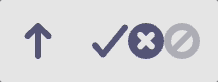
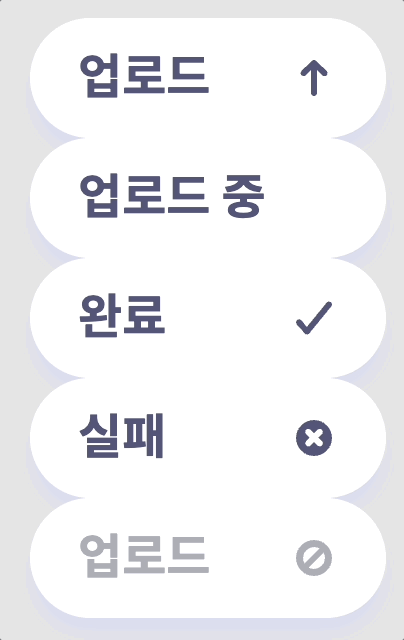

###### Connect To Front-end

# **Icon, UploadButton Component**

## 🚀 **Getting Started**

```
npm install
npm run dev
```

## ✨ **Features**

### Icon Component

<figure>

</figure>
<figcaption>type = <code>idle | pending | resolved | rejected | disabled</code></figcaption>

<br>

#### Usage

```js
import Icon from './components/Icon.js';

const root = document.getElementById('root');
const ReactDOMRoot = ReactDOM.createRoot(root);

ReactDOMRoot.render(
  <React.StrictMode>
    <Icon type="idle" />
    <Icon type="pending" />
    <Icon type="resolved" />
    <Icon type="rejected" />
    <Icon type="disabled" />
  </React.StrictMode>
);
```

### UploadButton Component

<figure>

</figure>
<figcaption>status = <code>idle | pending | resolved | rejected | disabled</code>
<br>disabled의 경우 버튼 속성 disabled가 true가 됩니다.</figcaption>

<br>

Usage

```js
import UploadButton from './components/UploadButton.js';

const root = document.getElementById('root');
const ReactDOMRoot = ReactDOM.createRoot(root);

ReactDOMRoot.render(
  <React.StrictMode>
    <UploadButton status="idle" />
    <UploadButton status="pending" />
    <UploadButton status="resolved" />
    <UploadButton status="rejected" />
    <UploadButton status="disabled" />
  </React.StrictMode>
);
```
